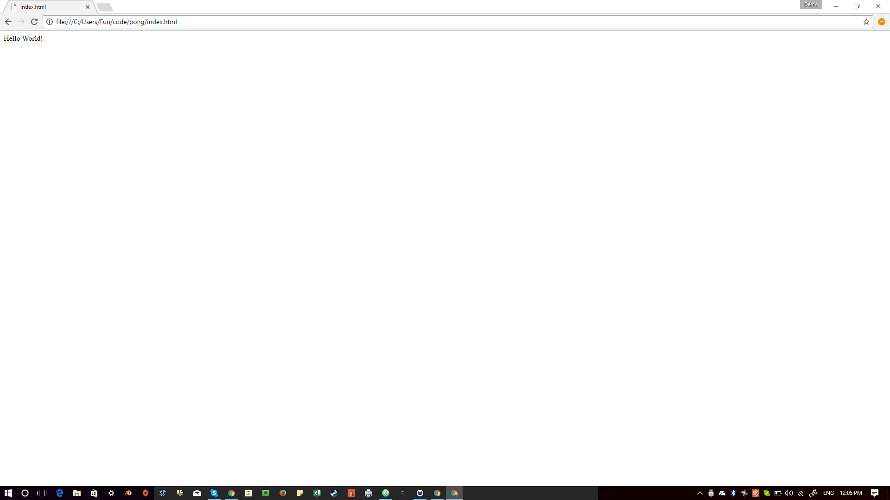

Part-01 - Fluent Games Pong tutorial
====================================

We'll create a skeleton project and show a empty canvas.

First we create a hello world in HTML

1.	Create a index.html file and enter the following

	```html
	<html>
	<body>
	  Hello World!
	</body>
	</html>
	```

2.	Use a browser to view the HTML file

	

3.	Now we'll add a head element between the <html> and <body>. We'll include a css style sheet

	```html
	<head>
	    <link rel="stylesheet" href="style.css" />
	</head>
	```

	create a style.css file with the following

	```css
	#gamediv{
	    background-color
	     #ccc;
	}
	```

	replace Hello World! in the body tag with gamediv:

	```diff
	-Hello World
	+<div id="gamediv">
	+</div`>
	```

	after this step you should have the following files:

	```javascript
	index.html
	style.css
	```

4.	Once again use the browser to see what we have so far.

5.	Now let's make sure our canvas works

	Within the gamediv tag add the following:

	```html
	<div id="gamediv">
	    <canvas width="640", height="360", id='gameCanvas'></canvas>
	    <script type="text/javascript" src="game.js" ></script>
	</div>
	```

	add a new file game.js with the contents:

	```javascript
	function intro(){
	  canvas = document.getElementById("gameCanvas")
	  ctx = canvas.getContext("2d")
	  ctx.fillText("Hello World", 300, 150)
	}
	intro();
	```

6.	If you use the browser to view the file this is what you should see:

7.	We'll draw a ball this time

	```javascript
	function draw_ball(x, y){
	  ctx.beginPath();
	  ctx.arc(x, y, 5, 0, 2*Math.PI);
	  ctx.stroke();
	}
	```

	and we call this at the end of into function

	```javascript
	function into(){
	    ...
	    ctx.fillText("Hello World", 300, 150)
	    draw_ball(400, 150)
	}
	```

8.	Let's use the browser to see what we've done

9.	It's kind of impressive to have a ball but you know what's more impressive? A moving ball of course.

	```javascript
	var ball;
	function intro(){
	    ...
	  update()
	}


	function update(){
	  ctx.clearRect(0, 0, canvas.width, canvas.height);
	  draw_ball(ball.x, ball.y)
	  setTimeout(intro, 1000/30);
	  ball.x += 5
	  ball.y += 3
	}


	ball ={
	  x: 400,
	  y: 200
	}
	```

10.	Now let's take a look what we have One small step for
